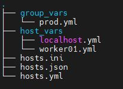
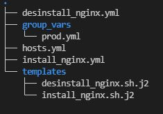
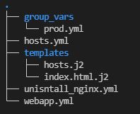
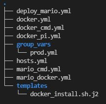
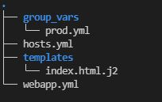

# ENVIRONNEMENT
* EC2 : 
    * Master : t3.medium / omar-ansible.ddns.net
    * Workers : t2.micro
* SG : 22 / 80 

# TP1: Installation
## Master
```bash
# via pip : dernière version
python3 --version
sudo apt-get update
sudo apt-get install python3-pip
sudo pip3 install ansible
ansible --version
# via gestionnaire de packet < latest:
sudo apt-get update
sudo apt-get install ansible
ansible --version

# installation de sshpass
sudo apt-get install sshpass -y
```
* fichier des configurations:
    * /etc/ansible/ansible.cfg
    * ~/.ansible.cfg
    * ./ansible.cfg

## Workers
```bash
# Activation de la connexion SSH par mot de passe
sudo vi /etc/ssh/sshd_config
# PasswordAuthentication yes

# Redemarrer le service ssh
sudo systemctl restart ssh

# Modifier le mot de passe du compte ubuntu
sudo -i
passwd ubuntu 
# (puis modifiez le mot de passe)
```

## Helps
* Désinstallation pauqets sur Linux
    * https://linuxfr.org/wiki/desinstaller-proprement-ses-paquets-sur-sa-distribution

# TP 2 : Commandes ad-hoc
#### ***`hosts au format ini`***
```ini
worker01 ansible_host=172.31.94.223 ansible_user=ubuntu ansible_password=ubuntu ansible_sudo_pass=ubuntu ansible_ssh_common_args='-o StrictHostKeyChecking=no'
worker02 ansible_host=172.31.91.167 ansible_user=ubuntu ansible_password=ubuntu ansible_sudo_pass=ubuntu ansible_ssh_common_args='-o StrictHostKeyChecking=no'
```
[master]
```bash
# command ping sur tous mes hosts
ansible -i hosts all -m ping
    worker02 | SUCCESS => {
        "ansible_facts": {
            "discovered_interpreter_python": "/usr/bin/python3"
        },
        "changed": false,
        "ping": "pong"
    }
    worker01 | SUCCESS => {
        "ansible_facts": {
            "discovered_interpreter_python": "/usr/bin/python3"
        },
        "changed": false,
        "ping": "pong"
    }
# command copy sur le worker01 uniquement
ansible -i hosts worker01 -m copy -a "dest=/home/ubuntu/omar.txt content='Bonjour ACJ\n'"
    worker01 | CHANGED => {
        "ansible_facts": {
            "discovered_interpreter_python": "/usr/bin/python3"
        },
        "changed": true,
        "checksum": "e5e5e1da0075c4ba5934eb2237b0d6e5f2984c72",
        "dest": "/home/ubuntu/omar.txt",
        "gid": 1000,
        "group": "ubuntu",
        "md5sum": "2cdc3b25b650c989dea96933409c1bde",
        "mode": "0664",
        "owner": "ubuntu",
        "size": 11,
        "src": "/home/ubuntu/.ansible/tmp/ansible-tmp-1640689065.710897-7928-10897906089111/source",
        "state": "file",
        "uid": 1000
    }
# supprimer le fichier
ansible -i hosts worker01 -m file -a "path=/home/ubuntu/omar.txt state=absent"
```

# TP 3 Modules

```bash
# via apt
ansible -i hosts all -m ping

ansible -i hosts worker01 -m apt -b -a 'name=apache2' -b
ansible -i hosts worker02 -m apt -b -a 'name=nginx' -b

ansible -i hosts worker01 -m apt -a 'name=apache2 state=absent purge=yes' -b
ansible -i hosts worker02 -m apt -a 'name=nginx state=absent purge=yes' -b

#ansible -i hosts worker01 -b -m apt -a "name=nginx state=absent purge=yes force_apt_get=yes"
#sudo apt-get remove --purge --auto-remove nginx

# via package
ansible -i hosts worker01 -m package -b -a "name=nginx state=present"
ansible -i hosts worker02 -m package -b -a "name=apache2 state=present"

ansible -i hosts worker01 -m service -a "name=nginx state=started enabled=yes" -b

ansible -i hosts worker01 -m package -b -a "name=nginx state=absent purge=yes autoremove=yes"
ansible -i hosts worker02 -m package -b -a "name=apache2 state=absent purge=yes autoremove=yes"
```
# TP4 : Invetaire au format yaml & module setup
#### ***`hosts.yml`***
```yml
all:
  hosts:
    worker01: 
      ansible_host: 172.31.94.223
      ansible_user: ubuntu 
      ansible_password: ubuntu 
      ansible_sudo_pass: ubuntu 
      ansible_ssh_common_args: '-o StrictHostKeyChecking=no'
      
    worker02: 
      ansible_host: 172.31.91.167
      ansible_user: ubuntu 
      ansible_password: ubuntu 
      ansible_sudo_pass: ubuntu 
      ansible_ssh_common_args: '-o StrictHostKeyChecking=no'
```
```bash
# tester un ping sur le worker01
ansible -i hosts.yml worker01 -m ping
# récupérer les information de nos machines setup
ansible -i hosts.yml all -m setup
ansible -i hosts.yml worker01 -m setup | grep -i hostname

# le module debug ne récupére pas les facts vérifie les inventaires

# ajouter la variable env pour worker01
ansible -i hosts.yml worker01 -m debug -a "msg={{ env }}"

# récupérer l'inventaire par défaut format json
ansible-inventory -i hosts.yml --list
# récupérer l'inventaire au format yaml
ansible-inventory -i hosts.yml --list -y

# récupérer l'inventaire d'un seul host:
ansible-inventory -i hosts.yml --host worker01
ansible-inventory -i hosts.yml --host worker01 -y
```

* gather_facts : False 
    * ne pas télécharger les information de nos machines

# TP5 : Inventaire et Variable
* créer fichier hosts.ini
```ini
[all:vars]
ansible_user=ubuntu

[ansible]
localhost ansible_connection=local

[prod]
worker01 ansible_host=172.31.94.223 ansible_password=ubuntu ansible_ssh_common_args='-o StrictHostKeyChecking=no'
worker02 ansible_host=172.31.91.167 ansible_password=ubuntu ansible_ssh_common_args='-o StrictHostKeyChecking=no'

[prod:vars]
env=production
```
```bash
# Transformer le fichier ini en fichier json et yml
ansible-inventory -i hosts.ini --list > hosts2.json
ansible-inventory -i hosts.ini --list -y > hosts2.yml

# réalisation de tests
ansible -i hosts.ini all -m ping
ansible -i hosts2.yml all -m ping
ansible -i hosts2.json all -m ping
```
#### ***`correction manuelle du hosts.yml`***
```yml
all:
  children:
    ansible:
      hosts:
        localhost:
          ansible_connection: local
    prod:
      hosts:
        worker01:
          ansible_host: 172.31.94.223
          ansible_ssh_common_args: -o StrictHostKeyChecking=no
        worker02:
          ansible_host: 172.31.91.167
          ansible_ssh_common_args: -o StrictHostKeyChecking=no          
      vars:
        ansible_password: ubuntu
        env: production   
  vars:
    ansible_user: ubuntu
```
#### ***`correction manuelle du hosts.json`***
```yml
{
    "all": {
        "children": {
            "ansible": {
                "hosts":{
                    "localhost": {
                        "ansible_connection": "local"
                    }
                }
            },
            "prod":{
                "hosts":{
                    "worker01": {
                        "ansible_host": "172.31.94.223",
                        "ansible_ssh_common_args": "-o StrictHostKeyChecking=no"
                    },
                    "worker02": {
                        "ansible_host": "172.31.91.167",   
                        "ansible_ssh_common_args": "-o StrictHostKeyChecking=no"                      
                    }
                },
                "vars":{
                    "ansible_password": "ubuntu",
                    "env": "production"
                }
            }       
        },
        "vars":{
            "ansible_user": "ubuntu"
        }
    }
}
```

# TP 6-7: surcharge de variable
* Création des repertoires et fichiers
    * group_vars/prod.yml
    * host_vars/worker01.yml
    * host_vars/localhost.yml



```bash
mkdir group_var host_vars
ansible -i hosts.ini all -m debug -a "msg={{ env }}"
ansible -i hosts.ini worker01 -m debug -a "msg={{ env }}" -e env='test'
```

# TP 8: Deployer un serveur web

#### ***`group_vars/prod.yml`***
```yml
env: prod
ansible_user: ubuntu
ansible_password: ubuntu
ansible_ssh_common_args: -o StrictHostKeyChecking=no
```
#### ***`prod.yml`***
```yml
all:
  children:
    ansible:
      hosts:
        localhost:
          ansible_connection: local
    prod:
      hosts:
        worker01:
          ansible_host: 172.31.93.31
        worker02:
          ansible_host: 172.31.91.167
      vars:
        env: production    
```

#### ***`nginx`***
```yml
---
- name: "Web Deployment"
  become: yes
  hosts: worker01

  tasks:
    - name: "install nginx"
      package:
        name: nginx
        state: present

    - name: "start nginx"
      service:
        name: nginx
        enabled: yes
        state: started

    - name: "Remove File index.html"
      file:
        path: /var/www/html/index.html
        state: absent

    - name: "Create File"
      copy:
        content: "Omar sur Nginx"
        dest: /var/www/html/index.html
```
```bash
#installer anisble-lint
sudo apt-get install ansible-lint

# vérifier la syntax du playbook
ansible-lint nginx.yml

# lancer le playbook
ansible-playbook -i prod.yml nginx.yml
```

# TP 9-10 : Jinja

#### ***`install_nginx.yml`***
```yml
---
- name: "Script Web Deployment"
  become: yes
  hosts: prod
  vars:
    web_package: nginx

  tasks:
    - name: "Copy Script "
      template:
        src: "install_nginx.sh.j2"
        dest: "/home/{{ ansible_user }}/install_nginx.sh"
 
    - name: "Execute Script"
      command: "sh /home/{{ ansible_user }}/install_nginx.sh"
```
#### ***`desinstall_nginx.yml`***
```yml
---
- name: "Script Web Deployment"
  become: yes
  hosts: worker02
  vars:
    web_package: nginx

  tasks:
    - name: "Copy Script "
      template:
        src: "desinstall_nginx.sh.j2"
        dest: "/home/{{ ansible_user }}/desinstall_nginx.sh"

    - name: "Execute Script"
      command: "sh /home/{{ ansible_user }}/desinstall_nginx.sh"
```
#### ***`templates/install_nginx.sh.j2`***
```j2
#!/bin/bash

sudo apt-get update -y
sudo apt-get install {{ web_package }} -y

sudo yum install epel-release -y
sudo yum update -y
sudo yum install {{ web_package }} -y

echo 'Distribution non prise en charge'

```
#### ***`templates/desinstall_nginx.sh.j2`***
```j2
#!/bin/bash

sudo apt-get purge --auto-remove {{ web_package }} -y

sudo yum purge {{ web_package }} -y

echo 'Distribution non prise en charge'

```
```bash
# lancer le playbook d'installation
ansible-playbook -i hosts.yml install_nginx.yml

# lancer le playbook de désinstallation
ansible-playbook -i hosts.yml desinstall_nginx.yml
```

# TP 11 : 

#### ***`hosts.yml`***
```yml
all:
  children:
    ansible:
      hosts:
        localhost:
          ansible_connection: local
          ansible_user: ubuntu
          hostname: AnsibleMaster
    prod:
      hosts:
        worker01: 
          ansible_host: 172.31.93.31
          hostname: AnsibleWorker01
        worker02:
          ansible_host: 172.31.91.167
          hostname: AnsibleWorker02
      vars:
        web_package: nginx 
  vars:
    ansible_sudo_pass: ubuntu 
```
#### ***`webapp.yml`***
```yml
---
- name: "Change hosts/ hostname for Master"
  become: yes
  hosts: localhost

  tasks:
    - name : "Change hostname command version"
      command: "sudo hostnamectl set-hostname {{ hostname }}"
    
    - name: "Copy hosts File From Template"
      template:
        src: hosts.j2
        dest: /etc/hosts

    #- name: "Edit the hosts file"
    #  command: "sh -c 'echo 127.0.0.1 {{ hostname }} >> /etc/hosts'"

- name: "Web Server"
  become: yes
  hosts: prod

  pre_tasks:
    - name : "Change Hostname module version"
      hostname:
        name: "{{ hostname }}"

    - name: "Copy hosts File From Template"
      template:
        src: hosts.j2
        dest: /etc/hosts

  tasks:
    - name: "Install Nginx"
      package:
        name: nginx
        state: present

    - name: "Start nginx"
      service:
        name: nginx
        enabled: yes
        state: started
        
    - name: "Remove File index.html"
      file:
        path: /var/www/html/index.html
        state: absent

    - name: "Git Clone the website"
      git:
        repo: "https://github.com/diranetafen/static-website-example.git"
        dest: "/var/www/html/"
        force: yes
    
    - name: "Copy Index File From Template"
      template:
        src: index.html.j2
        dest: /var/www/html/index.html

```
#### ***`templates/hosts.j2`***
```j2
127.0.0.1 localhost
127.0.0.1 {{ hostname }}
```
#### ***`templates/index.html.j2`***
```j2
...
<h1>Dimension {{ ansible_hostname }}</h1>
...
```

```bash
# "sh -c 'echo 127.0.0.1 {{ hostname }} >> /etc/hosts'" : defaut réécriture

# lancer le playbook d'installation
ansible-playbook -i hosts.yml webapp.yml

# test sur les machines distantes
curl 127.0.0.1 | grep -i "dimension"
systemctl status nginx

# lancer le playbook de désinstallation
ansible-playbook -i hosts.yml uninstall_nginx.yml
```
# TP 12 : 

#### ***`install.yml`***
```yml
---
- name: "Script Web Deployment"
  become: yes
  hosts: prod

  tasks:
    - name: "Install Nginx"
      apt:
        name: "{{ item }}"
        state: present
      when: ansible_distribution == "Ubuntu"
      loop:
        - nginx
        - git

    - name: "start nginx"
      service:
        name: nginx
        enabled: yes
        state: started
      when: ansible_distribution == "Ubuntu"
```
#### ***`uninstall.yml`***
```yml
---
- name: "Uninstall Nginx"
  become: yes
  hosts: prod

  tasks:
    - name: "Desinstall Nginx"
      apt:
        name: nginx
        state: absent
        purge: yes
        autoremove: yes
      when: ansible_distribution == "Ubuntu"
```
```bash
# lancer le playbook d'installation
ansible-playbook -i hosts.yml install.yml

# lancer le playbook de désinstallation
ansible-playbook -i hosts.yml uninstall.yml
```

# TP 13 : Include tasks and tags


#### ***`main.yml`***
```yml
---
- name: "Script Web Deployment"
  become: yes
  hosts: prod

  tasks:
    - include_tasks: install.yml
      when: ansible_distribution == "Ubuntu"
      loop:
        - nginx
        - git

    - name: "Start nginx"
      service:
        name: nginx
        enabled: yes
        state: started
      when: ansible_distribution == "Ubuntu"

- name: "Uninstall Nginx"
  become: yes
  hosts: prod
  tags: uninstall

  tasks:
    - include_tasks: uninstall.yml
      when: ansible_distribution == "Ubuntu"
```
#### ***`install.yml`***
```yml
---
- name: "Install Applications"
  apt:
    name: "{{ item }}"
    state: present

- name: "Remove File index.html"
  file:
    path: /var/www/html/index.html
    state: absent

- name: "Create File"
  copy:
    content: "Omar Piotr BENNANI\n"
    dest: /var/www/html/index.html
```
#### ***`uninstall.yml`***
```yml
---
- name: "Desinstall Nginx"
  apt:
    name: nginx
    state: absent
    purge: yes
    autoremove: yes
```

```bash
# lancer uniquement l'installation
ansible-playbook -i hosts.yml main.yml --skip-tags "uninstall"

# lancer uniquement la désinstallation
ansible-playbook -i hosts.yml main.yml --tags "uninstall"
```

# TP 14 : Import_playbook and Docker

## 1- via command
* fichiers
    * deploy_mario.yml (contient les includes des autres Playbook)
    * docker.yml (Playbook : installation de docker)
    * mario_cmd.yml (Playbook : lancement d'un contenaire docker via command)

#### ***`deploy_mario.yml`***
```yml
---
- import_playbook: "docker.yml"
- import_playbook: "mario_cmd.yml"
```
#### ***`docker.yml`***
```yml
---
- name: "Docker Installation"
  become: yes
  hosts: worker02

  tasks:
  - name: Download Install docker script
    get_url:
      url: "https://get.docker.com"
      dest: /home/ubuntu/get-docker.sh

  - name: run script to install docker
    command: "sh /home/ubuntu/get-docker.sh"

  - name: give the privilège to ubuntu
    user:
      name: ubuntu
      append: yes
      groups:
        - docker
```
#### ***`mario_cmd.yml`***
```yml
---
- name: "Docker Installation"
  become: yes
  hosts: worker01

  tasks:
    - name: "Execute Mario docker Script"
      command: "docker run -d --name mario -p 8600:8080 pengbai/docker-supermario"
```


## 2- via module docker_container
* prérequis : installer sur la machine cliente:
    * python pip
    * docker-py (via pip)
* fichiers
    * deploy_mario.yml (contient les includes des autres Playbook)
    * docker.yml (Playbook : installation de docker)
    * docker_pi.yml (Playbook : installation de pip et de docker-py via pip)
    * mario_docker.yml (Playbook : lancement d'un contenaire le module docker_container)

#### ***`deploy_mario.yml`***
```yml
---
- import_playbook: "docker.yml"
- import_playbook: "docker_pi.yml"
- import_playbook: "mario_docker.yml"
```

#### ***`docker_pi.yml`***
```yml
---
- name: "Docker Installation"
  become: yes
  hosts: prod

  tasks:
  - name: "Install python pip"
    apt:
        name: python3-pip
        state: present
    when: ansible_distribution == "Ubuntu"

  - name: "Install docker-py module"
    pip:
        name: docker-py
        state: present
```

#### ***`mario_docker.yml`***
```yml
---
- name: "Docker Installation"
  become: yes
  hosts: worker02

  tasks:
    - name: "Create Mario container"
      docker_container: 
        name: mario
        image: pengbai/docker-supermario
        ports:
          - "8600:8080"
```


# TP 15 : Container httpd avec static-website
* Serveur Ansible
    * créer le template pour le fichier index.html
* Machine distante 
    * Créer un dossier
    * Clone le projet dessus
    * Copier le template 


#### ***`webapp.yml`***
```yml
---
- name: "Docker httpd container"
  become: true
  hosts: worker01

  tasks:
    - name: "Create directory"
      file:
        path: "/home/ubuntu/static-website"
        state: directory

    - name: "Git Clone"
      git:
        repo: "https://github.com/diranetafen/static-website-example.git"
        dest: "/home/ubuntu/static-website"
        force: yes

    - name: "Copy Index File From Template"
      template:
        src: index.html.j2
        dest: /home/ubuntu/static-website/index.html
        
    - name: "Create httpd container"
      docker_container: 
        name: webapp
        image: httpd
        ports:
          - "80:80"
        volumes:
          - "/home/ubuntu/static-website:/usr/local/apache2/htdocs/"
```

# TP 16 : sécurité


## supprimer les mots de passes en utilisant la connexion ssh
```bash
# Mettre en commentaire les lignes dans les fichiers yml avec "ansible_password:"
ansible -i hosts.yml all -m ping
# échec

# Télécharger puis changer le mode de la clé:
sudo chmod 400 omar-kp-ajc.pem

# Commande impératives :
ansible -i hosts.yml all -m ping --private-key "/home/ubuntu/omar-kp-ajc.pem"
ansible -i hosts.yml all -m ping --key-file "/home/ubuntu/omar-kp-ajc.pem"

```
* Ajouter la variable dans nos fichier .yml afin de ne plus spécifier la clé dans la ligne de commande
### ***`Nos fichiers YAML`***
```yml
vars:
    ansible_ssh_private_key_file: "/home/ubuntu/omar-kp-ajc.pem"
```

## crypter des donnée avec Ansible-volt
* créer un fichier secretes.yml contenat les variables sensibles
* encypter le fichier à l'aide de ansible-vault encrypt
    * pass / confirm
* ajouter vars_files dans notre playbook
* bonne pratiques
    * créer des variables `_vault_` dans notre fichier encrypté
    * appeler ces variables `_vault_` depuis nos "manifests"

#### ***`secret.yml`***
```yml
ansible_vault_user: ubuntu
ansible_vault_sudo_pass: ubuntu
```
#### ***`/group/vars/prod.yml`***
```yml
ansible_user: "{{ ansible_vault_user }}"
ansible_sudo_pass: "{{ ansible_vault_sudo_pass }}"
ansible_ssh_common_args: -o StrictHostKeyChecking=no
ansible_ssh_private_key_file: "/home/ubuntu/omar-kp-ajc.pem"
```
#### ***`webapp.yml : rajouter les vars_files`***
```yml
---
- name: "Docker httpd container" 
  hosts: worker01  
  vars_files:
    - "./secrets.yml"

  tasks:
  ...
```

```bash
# Encypter le fichier secrets.yml:
ansible-vault encrypt secrets.yml

# lancer le playbook avec l'option --ask-vault-password
ansible-playbook -i hosts.yml webapp.yml --ask-vault-password

# Si besoin de modifier le fichier secretes il faut le décrypter:
ansible-vault decrypt secrets.yml
```

## Fichier de configuration
* Priorité :
    * 1- Variables d'environnement : ANSIBLE_CONF
    * 2- Projet : /[Projec_Path]/ansible.cfg
    * 3- Home : /home/[user]/ansible.cfg
    * 4- défaut : /etc/ansible/ansible.cfg
* ansible.cfg est un fichier de type ini
* Chercher dans ansible configuration
    * https://docs.ansible.com/ansible/latest/reference_appendices/config.html


* Exemple :
    * spécifier l'inventaire pour ne plus écrire -i hosts.yml
    * activer le vault par défaut pour supprimer l'option --ask-vault-password
    * monter les privilège par défaut (become: true) 

#### ***`ansible.cfg`*** 
```ini
[defaults]
inventory=/home/ubuntu/TP16/hosts.yml
ask_vault_pass = true

[privilege_escalation]
become=true
```

```bash
# vérifier que le config est bien pris en compte
ansible --version

# ansible-playbook -i hosts.yml webapp.yml --ask-vault-password 
ansible-playbook webapp.yml
```

* on pourrait rajouter la private_key par défaut :
```ini
[default]
private_key_file=/home/ubuntu/omar-kp-ajc.pem
```