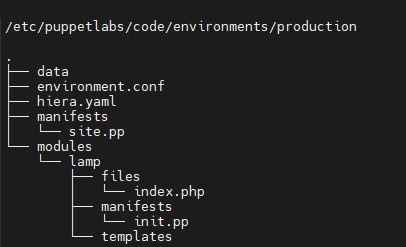

# 1) INSTALLATION / CONFIGURATIONS PUPPET

## 1.1) PRE-REQUIS (AWS)
* EC2
    * t2.medium (4Go RAM / 2 CPU / 20 Go)
* SG
    * Ports SSH (22) / ICMP (ping) / 8140 (puppet)

## 1.2) Initialisation des 2 machines
```bash
# initialisation
sudo su -
yum update -y
yum install vim -y

# renomer nos hostname : puppetmaster / agents
vim /etc/hostname

# ajouter des hosts
vim /etc/hosts 
# ou
echo '172.31.95.61 puppetmaster.omar.edu puppetmaster' >> /etc/hosts
echo '172.31.83.83 agentcentos.omar.edu agentcentos' >> /etc/hosts
echo "172.31.94.237 agentubuntu.omar.edu agentubuntu" >> /etc/hosts
# ou 
echo -e '172.31.95.61 puppetmaster.omar.edu puppetmaster\n172.31.83.83 agentcentos.omar.edu agentcentos\n172.31.94.237 agentubuntu.omar.edu agentubuntu' >> /etc/hosts

# vérifier nameserver 172.31.0.2
cat /etc/resolv.conf

# SELENUX=disabled
vi /etc/sysconfig/selinux
# ou
vi /etc/selinux/config
# redémarrer le system

# Test de ping depuis chacunes des machines
ping puppetmaster.omar.edu
ping client.omar.edu
```
## 1.3) Configuration de la machine SERVEUR
```bash
# ajouter le dépot
rpm -Uvh https://yum.puppet.com/puppet7-release-el-7.noarch.rpm
yum update

# installer le serveur (+agent)
yum install puppetserver -y
systemctl start puppetserver
systemctl enable puppetserver

# déconnecter et se reconnecter avec sudo
exit
sudo su -

# vérifications
where is puppet
yum info puppetserver
yum info puppet-agent
puppetserver -v

# configuration
vi /etc/puppetlabs/puppet/puppet.conf
```

```
[master]
dns_alt_names = puppetmaster.omar.edu,puppetmaster

[main]
certname = puppetmaster.omar.edu
server = puppetmaster.omar.edu
environment = production
runinterval = 1h 
```

```bash
# redémmarrer le serveur
systemctl restart puppetserver

# afficher les certificat signés par le serveur
puppetserver ca list --all
# ca_crt.pem = certificat qui va signer
```

* puppet : commande pour l'agent
* puppetserver : pour le serveur


## 1.4) Configuration de la machine CLIENT / SLAVE (centos)
```bash
# installation de l'agent
rpm -Uvh https://yum.puppet.com/puppet7-release-el-7.noarch.rpm
yum update
yum install puppet-agent -y

# déconnecter et se reconnecter avec sudo
exit
sudo su -

# vérifications
where is puppet
yum info puppet-agent

# configuration
vi /etc/puppetlabs/puppet/puppet.conf
```
```
[main]
certname = client.omar.edu
server = puppetmaster.omar.edu
environment = production
runinterval = 1h 
```

## 1.5) Configuration de la machine CLIENT / SLAVE (ubuntu)
```bash
sudo su -
apt-get update
# renomer nos hostname : puppetmaster / agents
vim /etc/hostname
# ajouter des hosts
vim /etc/hosts 

# installer puppet
wget https://apt.puppet.com/puppet7-release-focal.deb
sudo dpkg -i puppet7-release-focal.deb
sudo apt-get update
sudo apt-get install puppet-agent
# faire la config de /etc/puppetlabs/puppet/puppet.conf
# sortir et rerentrer dans le sudo
exit
sudo su -
```

## 1.6) Démarrage de l'agent et signature du certificat
* coté agent : envoyer la demande de certifcat au serveur/master
    ```bash
    # activer l'agent qui va envoyer la demande de certificats 
    puppet resource service puppet ensure=running enable=true
    # verifier 
    systemctl status puppet
    ```
* coté serveur : singer le certificat venant de l'agent
    ```bash
    # afficher les certificats en attente de validation (celui de l'agent)
    puppetserver ca list
    # générer puis singer le certificat
    puppetserver ca sign --certname client.omar.edu
    ```

# 2) LAB 0 : Premier manifeest  (création d'un repertoire)
## serveur puppet
```bash
cd /etc/puppetlabs/code/environments/production/manifests/
# le premier manifest qui est lu est site.pp
vim site.pp
```
```ruby
node 'client.omar.edu' 
{
    file { '/tmp/omar':
        ensure => 'directory',
        owner => 'root',
        group => 'root',
        mode => '0755',
    }

    group {'omar':
        ensure => present,
        name => 'omar',
        gid => '2000',
    }

    user {'omar':
        ensure => present,
        uid => '2000',
        gid => '2000',
        shell => '/bin/bash',
        home => '/home/omar'
    }

    file { '/home/omar':
        ensure => 'directory',
        owner => 'omar',
        group => 'omar',
        mode => '0755',
    }
}
```

## client / agent 
```bash
# On force l'agent à tester le serveur sans attendre l'interval
puppet agent -t
# ou
puppet agent --test
```

# 3) LAB 1 : Installation d'un serveur LAMP
* agent sur machine centos : httpd / mariadb / php
* agent sur machine ubuntu : apache2/ mysql / php
* création d'un module "lamp" sous puppet

    

```Ruby
# /etc/puppetlabs/code/environments/production/manifests/site.pp
node 'agentcentos.omar.edu' 
{
    include lamp
}

node 'agentubuntu.omar.edu' 
{
    include lamp
}
```

```Ruby
#  /etc/puppetlabs/code/environments/production/modules/lamp/manifests/init.pp
class lamp::update {
    if $facts['os']['name'] == 'Ubuntu'
    {
        exec { 'update':     
            command => "/usr/bin/apt-get update -y"   
        }
    }
    elsif $facts['os']['name'] == 'CentOS'
    {
        exec { 'update':     
            command => "/usr/bin/yum update -y"  
        }
    }   
}

class lamp::epel_release {
    if $facts['os']['family'] == 'RedHat'
    {
        package { 'epel-release':
            require => Class['lamp::update'],
            ensure => installed,      
        }
    }
}

class lamp::apache {
    $web = $operatingsystem ? 
    {
        /(Red Hat|CentOS|Fedora)/ => "httpd", 
        'Ubuntu' => "apache2",
        default => "httpd",
    }
    package { "apache lamp":
        name => $web,
        require => Class['lamp::update'],
        ensure => installed,        
    }
}

class lamp::apache_service {
    service { 'apache lamp':
        name => $operatingsystem ?
        {
            /(Red Hat|CentOS|Fedora)/ => "httpd", 
            'Ubuntu' => "apache2",
            default => "httpd",
        },
        ensure => running,
    }
}

class lamp::mysql { 
    package { 'mysql lamp':
    name => $operatingsystem ?
        {
            /(Red Hat|CentOS|Fedora)/ => "mariadb", 
            'Ubuntu' => "mysql-server",
        },
        ensure => installed,      
    }
}

class lamp::mysql_service {
    service { 'mysql lamp':
        name => $operatingsystem ?
        {
            /(Red Hat|CentOS|Fedora)/ => "mariadb", 
            'Ubuntu' => "mysql",
        },
        ensure => running,
    }
}

class lamp::php {
    package { 'php':
        require => Class['lamp::update'],
        ensure => installed,                
    }
}

class lamp::php_init {
    file { '/var/www/html/index.php':
        ensure => file,
        source => "puppet:///modules/lamp/index.php",
        require => Class['lamp::apache'],
        notify => Class['lamp::apache_service'],
    }

    if $facts['os']['family'] == 'RedHat'
    {
        file { '/etc/httpd/conf.d/welcome.conf':
            ensure => absent,
            notify => Class['lamp::apache_service'],       
        }
    }

    if $facts['os']['name'] == 'Ubuntu'
    {
        file { '/var/www/html/index.html':
            ensure => absent,
            notify => Class['lamp::apache_service'],       
        }
    } 
}

class lamp {
    include lamp::update, lamp::epel_release, lamp::apache, lamp::apache_service, lamp::mysql, lamp::mysql_service, lamp::php, lamp::php_init
}

```

```html
<!-- /etc/puppetlabs/code/environments/production/modules/lamp/files/index.php -->
<!DOCTYPE html>
<html>
<body>

<h1>Omar Piotr LAMP</h1>
<p><?php
    echo "<div>Bonjour</div>";
    phpinfo(); ?></p>

</body>
</html> 
```